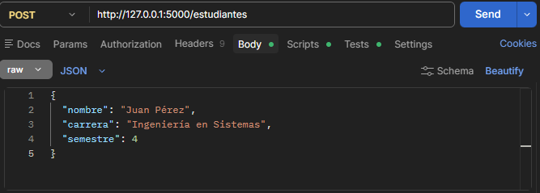
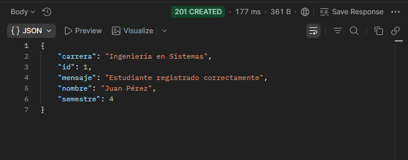

# API REST con Flask y MySQL 🐍🗄️

API para registrar y consultar estudiantes en una base de datos MySQL, desarrollada con Python y Flask.

---
## Ángel Gabriel Rojas Hernández 
---

## Requisitos previos

- Python 3.8 o superior
- MySQL instalado y corriendo
- pip

---

## Instalación y configuración

**1. Clona el repositorio**
```bash
git clone https://github.com/tu-usuario/ejercicio3-api.git
cd ejercicio3-api
```

**2. Crea y activa el entorno virtual**
```bash
py -m venv venv
venv\Scripts\activate        # Windows
source venv/bin/activate     # Mac / Linux
```

**3. Instala las dependencias**
```bash
pip install flask flask-cors mysql-connector-python
```

**4. Crea la base de datos en MySQL**

Abre MySQL Workbench y ejecuta:
```sql
CREATE DATABASE estudiantes_db;

USE estudiantes_db;

CREATE TABLE estudiantes (
    id       INT AUTO_INCREMENT PRIMARY KEY,
    nombre   VARCHAR(100) NOT NULL,
    carrera  VARCHAR(100) NOT NULL,
    semestre INT NOT NULL
);
```

**5. Configura tu conexión**

Abre `ejercicio3.py` y edita el bloque `DB_CONFIG` con tus datos:
```python
DB_CONFIG = {
    'host':     'localhost',
    'user':     'root',
    'password': 'tu_contraseña',
    'database': 'estudiantes_db'
}
```

**6. Ejecuta la API**
```bash
python ejercicio3.py
```
El servidor corre en `http://127.0.0.1:5000`

---

## Endpoints

### POST /estudiantes — Registrar un estudiante

Agrega un nuevo estudiante a la base de datos.

**URL**
```
POST http://127.0.0.1:5000/estudiantes
```

**Body (JSON)**
```json
{
  "nombre": "Juan Pérez",
  "carrera": "Ingeniería en Sistemas",
  "semestre": 4
}
```

**Respuesta exitosa (201)**
```json
{
  "mensaje": "Estudiante registrado correctamente",
  "id": 1,
  "nombre": "Juan Pérez",
  "carrera": "Ingeniería en Sistemas",
  "semestre": 4
}
```

**Capturas de pantalla**

<!-- Agrega aquí tu captura del POST en Postman -->


<!-- Agrega aquí tu captura de la respuesta del POST -->


---

## Manejo de errores

La API valida todos los campos de entrada y responde con código `400` si falta alguno:

| Situación | Mensaje |
|---|---|
| No se envía body | `"No se recibieron datos"` |
| Falta el nombre | `"Falta el campo nombre"` |
| Falta la carrera | `"Falta el campo carrera"` |
| Falta el semestre | `"Falta el campo semestre"` |
| Error de base de datos | Mensaje del error (500) |

---

## Estructura del proyecto

```
ejercicio3-api/
├── venv/
├── ejercicio3.py
└── README.md
```

---

## Comandos para retomar el proyecto

Cada vez que vuelvas a trabajar en el proyecto ejecuta:
```bash
cd ejercicio3-api
venv\Scripts\activate
python ejercicio3.py
```

Cada vez que vuelvas a trabajar en el proyecto ejecuta:
```bash
cd ejercicio3-api
venv\Scripts\activate
python ejercicio3.py
```
